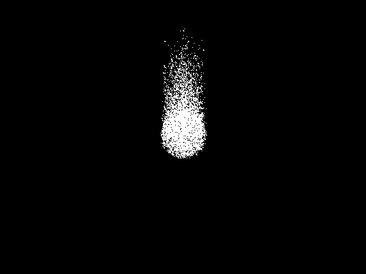

# Final Project: Realistic Fire Simulation System

Ashley Huo, x2huo, 20875817


# Realistic Fire Simulation System

## Description
This project aims to develop a realistic fire simulation system using rasterization with a particle system, incorporating interactions with objects and environmental factors. The simulation will demonstrate realistic fire behaviors, including combustion, fuel vaporization, and interactions with the environment using advanced rendering techniques.

## Features (See also the objectives below)
1. **Basic Fire Simulation**: Implementation of a fire particle system where particles are born in a random position within a specified area, with an upwards velocity and slightly deviated acceleration.
2. **Color Update**: Dynamic color changes based on particle lifetime.
3. **GPU Rendering**: Rendering particles on the GPU for faster performance.
4. **Level-Set Method**: Use of level-set methods for more accurate simulations of thin flame models.
5. **Vorticity Confinement**: Enhance the turbulence of fire using vorticity confinement techniques.
6. **Collision Handling**: Realistic particle interactions and collisions.
7. **Environmental Interaction**: Fire interacting with objects in the environment.
8. **Faster Simulation**: Optimizing algorithms for real-time performance.
9. **Fire as Light Source**: Potential use of fire as a light source in a scene.
10. **Wind Effects**: Adding wind forces to the particles to simulate wind effects.
11. **Smoke Simulation**: Additional particles for smoke to enhance visual complexity.


## Requirements

- **GLM**: OpenGL Mathematics library for vector and matrix operations.
- **GLFW**: Library for creating windows and handling input.
- **GLEW**: OpenGL Extension Wrangler Library for managing OpenGL extensions.


## Implementation Details

### Algorithms and Data Structures
- **Particle System**: Utilizes a particle-based approach to simulate fire and smoke.
- **Level-Set Method**: Represents thin reaction zones using level-set techniques.
- **Vorticity Confinement**: Enhances turbulence by computing vorticity and applying confinement forces.
- **Grid-Based Methods**: Efficiently handle particle interactions and vorticity confinement using spatial grids.
- **Ray Marching**: Used for realistic rendering of fire and smoke effects.

### Platform and System Dependence
- The simulation is implemented in C++ using OpenGL for rendering.
- It is platform-independent as long as the required libraries are supported.
- Use the most recent version for `std_image.h` and `std_image_write.h`.

### Input/Output Syntax
- Inputs: Initial parameters for the particle system, such as the number of particles, initial fuel, and temperature.
- Outputs: Visual rendering of the fire simulation and additional effects like smoke, wind, color changes, reduction,
- and interactions with objects.

### Data and Code Sources
- **Fire and Flame Simulation using Particle Systems and Graphical Processing Units** by T.S. Lyes and K.A. Hawick.
- **Level Set Methods and Fast Marching Methods** by Sethian.
- **Physically Based Modeling and Animation of Fire** by Nguyen, Fedkiw, and Jensen.
- Some texture images are from [Textures.com](https://www.textures.com/) as well as github.

### Caveats, Bugs, and Assumptions
- **Caveats**: Performance may vary depending on the hardware capabilities.
- **Bugs**: Ensure all required libraries are correctly installed to avoid runtime errors.
- **Assumptions**: The simulation assumes ideal conditions for fire propagation and interactions.


## Technical Outline

### 1. Develop a Basic Particle System for Fire and Smoke Simulation
**Properties**: Particles are born in a random position inside a circular area with upwards velocity and slightly deviated acceleration along the x and z axes.

- Use a particle system where particles are born within a specified area with an upwards velocity.
- Implement GPU rendering for faster performance.


```cpp
// Basic fire particle system implementation
void reset(bool smoke, const glm::vec3& firePosition = glm::vec3(0.0f)) {
    // Initialize fire or smoke particles with random positions and velocities
    // ...
}
```




### 2. Model Combustion and Color of Fuels
- Add a temperature field and modify the color of particles in the system.

 **Method**: Add a function `updateColor` to update particle color based on lifetime.

```cpp
void updateColor() {
    currentColor = Color::lerp(startColor, endColor, t);
    currentColor.a = 1.0f - t; // Fade out over lifetime
}
```


### 3. Implement Thin Flame Model for Reaction Zone Simulation
- Use level-set methods to represent the thin reaction zone.

```cpp
void applyForces(float deltaTime, const std::vector<float>& phi, const std::vector<float>& uf, const std::vector<float>& vf, const std::vector<float>& wf, int gridSize, float h) {
    // Calculate the gradient (normal) of phi at the particle's position
    // ...
}
```

### 4. Swap to GPU Rendering

**Method**: Create vertex and fragment shaders for GPU rendering and add volume for particles to enhance realism.

```glsl
// Fragment shader example for rendering fire particles
vec4 marchRay(vec3 rayOrigin, vec3 rayDir, float tMin, float tMax) {
    // Ray marching logic for fire rendering
    // ...
}
```

### 5. Apply Vorticity Confinement to Enhance Turbulence
- Use vorticity confinement techniques to simulate small-scale turbulence and swirling effects.

**Method**: Use vorticity confinement techniques to simulate small-scale turbulence and swirling effects.

```cpp
glm::vec3 vorticity(0.0f);
for (auto& neighbor : cell) {
    if (particle != neighbor) {
        glm::vec3 r = neighbor->position - particle->position;
        glm::vec3 v = neighbor->velocity - particle->velocity;
        if (glm::length(r) < neighbor->size && glm::dot(r, r) != 0) {
            vorticity += glm::cross(v, r) / glm::dot(r, r);
        }
    }
}
```

```cpp
for (int dx = -1; dx <= 1; ++dx) {
    for (int dy = -1; dy <= 1; ++dy) {
        for (int dz = -1; dz <= 1; ++dz) {
            glm::ivec3 neighborIdx = idx + glm::ivec3(dx, dy, dz);
            if (neighborIdx.x >= 0 && neighborIdx.x < gridResolution && neighborIdx.y >= 0 && neighborIdx.y < gridResolution && neighborIdx.z >= 0 && neighborIdx.z < gridResolution) {
                for (auto& neighbor : grid[neighborIdx.x][neighborIdx.y][neighborIdx.z]) {
                    glm::vec3 r = neighbor->position - particle.position;
                    gradient += (neighbor->vorticity - particle.vorticity) / (glm::dot(r, r) + 1e-5f); // Avoid division by zero
                }
            }
        }
    }
}


glm::vec3 n = glm::normalize(gradient);
glm::vec3 confinementForce = epsilon * glm::cross(n, particle.vorticity);

if (!std::isnan(confinementForce.x) && !std::isnan(confinementForce.y) && !std::isnan(confinementForce.z)) {
    particle.confinementForce = confinementForce;
}
```

### 6 smoke simulation
Enable by commenting in the `#define SMOKE` in the `fire.h` file. Add some type particles.

[//]: # (![smoke.png]&#40;running-results%2Ffire%2Fsmoke.png&#41;)


### 7. Enable Interaction of Fire with Environmental Objects
- Allow fire to interact with objects, including ignition and burning of flammable objects.
Enabled by commenting in the `#define CUBE` in the header file.

**Method**: Implement interactions of fire with environmental objects such as cubes or other flammable objects.

```cpp
void checkCubeFireCollision() {
    if (cubePosition.x > 0.0f) {
        cubeOnFire = true;
    }
}
```


### 8. Optimize for Faster Simulation
- Use efficient data structures like grids for fluid simulation and particles for fire and smoke.
- Leverage GPU acceleration.
 
**Method**: Optimize simulation algorithms and leverage GPU acceleration for real-time performance. Use grid-based methods to improve efficiency.

```cpp
void computeVorticity() {
    // Clear grid
    for (auto& plane : grid) {
        for (auto& row : plane) {
            for (auto& cell : row) {
                cell.clear();
            }
        }
    }

    for (auto& particle : particles) {
        glm::ivec3 idx = getGridIndex(particle.position);
        if (idx.x >= 0 && idx.x < gridResolution && idx.y >= 0 && idx.y < gridResolution && idx.z >= 0 && idx.z < gridResolution) {
            grid[idx.x][idx.y][idx.z].push_back(&particle);
        }
    }

    // Compute vorticity for each particle
    for (auto& plane : grid) {
        for (auto& row : plane) {
            for (auto& cell : row) {
                for (auto& particle : cell) {
                    glm::vec3 vorticity(0.0f);
                    for (auto& neighbor : cell) {
                        if (particle != neighbor) {
                            glm::vec3 r = neighbor->position - particle->position;
                            glm::vec3 v = neighbor->velocity - particle->velocity;
                            if (glm::length(r) < neighbor->size && glm::dot(r, r) != 0) {
                                vorticity += glm::cross(v, r) / glm::dot(r, r);
                            }
                        }
                    }
                    particle->vorticity = vorticity;
                }
            }
        }
    }
}
```


### 9. Handle Collisions

**Method**: Implement collision handling between particles to ensure realistic interactions.

```cpp
void handleCollisions() {
    for (size_t i = 0; i < particles.size(); ++i) {
        for (size_t j = i + 1; j < particles.size(); ++j) {
            if (checkCollision(particles[i], particles[j])) {
                resolveCollision(particles[i], particles[j]);
            }
        }
    }
}

```

### 10. Add Wind Effects
- Add wind forces to particles to simulate wind effects.

- Enable by commenting in the `#define WIND` in the header file.

**Method**: Add wind forces to the particles to simulate wind effects.

```cpp
void applyWindForce(float deltaTime) {
    for (auto& particle : particles) {
        particle.velocity += windForce * deltaTime;
    }
}
```


## Additional Features to be implemented:

### Texture mapping
Partialy working, but the texture is not correctly mapped to the particles.


### enable reflection and refraction
Partially working, the reflection is not correctly implemented.


## Objectives
1. Develop a basic particle system for fire and smoke simulation.
2. Model the combustion and color of fuels.
3. Implement the thin flame model for the reaction zone simulation.
4. Swap to GPU rendering.
5. Apply vorticity confinement to enhance the turbulence of fire.
6. Smoke simulation.
7. Enable interaction of fire with environmental objects.
8. Optimize the simulation for faster performance.
9. Handle collisions between particles.
10. Add wind effects to the system.


## Bibliography

- Fedkiw, R., Stam, J., & Jensen, H. W. (2001). Visual Simulation of Smoke. SIGGRAPH 2001, ACM.
- Nguyen, D. Q., Fedkiw, R., & Jensen, H. W. (2002). Physically Based Modeling and Animation of Fire. ACM Transactions on Graphics.
- Sethian, J. A. (1999). Level Set Methods and Fast Marching Methods. Cambridge University Press.
- Osher, S., & Fedkiw, R. (2003). Level Set Methods and Dynamic Implicit Surfaces. Springer-Verlag.
- Persson, P. O. (2005). The Level Set Method. MIT Numerical Methods for Partial Differential Equations.
- [Visual Simulation of Fire](https://physbam.stanford.edu/~fedkiw/papers/stanford2003-11.pdf)
- [Realistic and Interactive Simulation of Fire](http://graphics.ucsd.edu/~henrik/papers/fire/fire.pdf)
- [Fronts Propagating with Curvature Dependent Speed](https://math.berkeley.edu/~sethian/2006/Papers/sethian.osher.88.pdf)
- [Navier–Stokes Equations](https://en.wikipedia.org/wiki/Navier%E2%80%93Stokes_equations)
